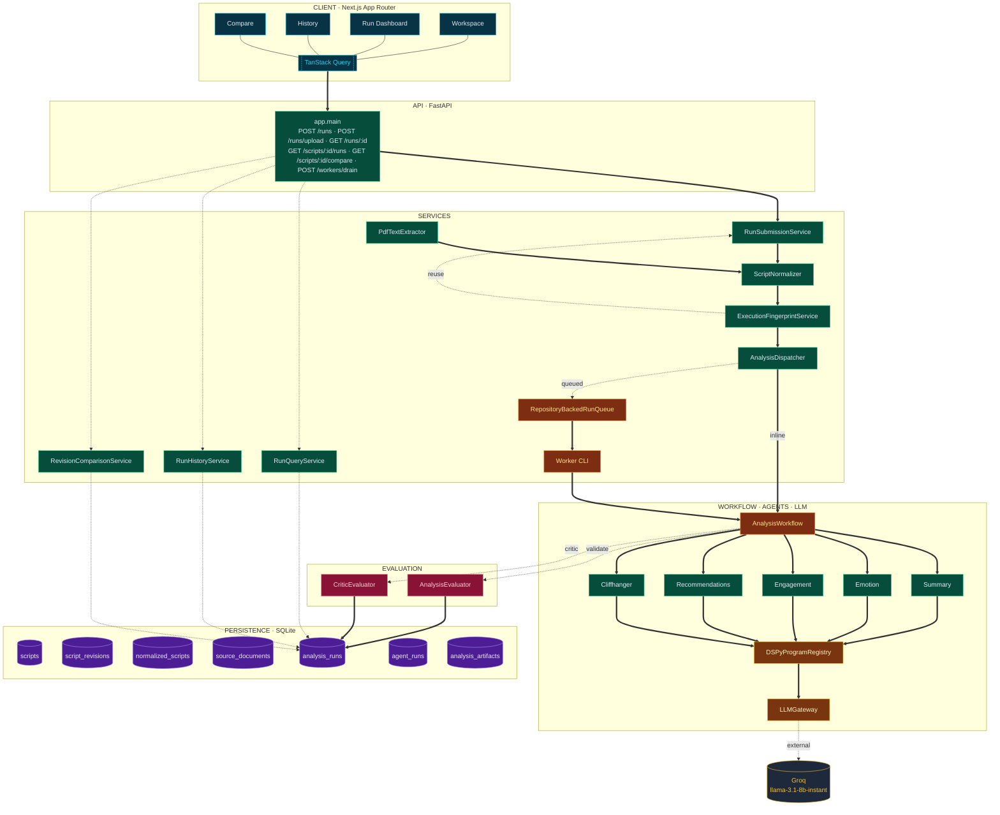

# Script Insights

Script Insights is a multi-agent content intelligence platform for short-form script analysis. It accepts pasted text or PDF uploads, normalizes the script into a canonical structure, runs specialized analysis agents, and returns a structured dashboard with revision history and compare flows.

This implementation intentionally goes beyond the minimum assignment shape while staying aligned to the core task: analyze a short script, explain the story and emotional arc, estimate engagement potential, and suggest concrete storytelling improvements.

## Assignment Alignment

This repository satisfies the assignment goals in `TASK.md`:

- accepts short script input as pasted text
- also supports PDF upload as an extended input path
- returns a 3-4 line story summary
- analyzes emotional tone, dominant emotions, and emotional arc
- scores engagement potential with factor-level reasoning
- suggests improvements in pacing, conflict, dialogue, and emotional impact
- identifies a cliffhanger / suspenseful moment as an optional enhancement
- provides a lightweight but polished web interface for submitting and reviewing results

## Overall Approach

The system is built as a small but real agentic platform rather than a single prompt wrapper.

1. Ingest script input from text or PDF.
2. Normalize the content into scenes, dialogue blocks, and evidence spans.
3. Run specialized agents for `summary`, `emotion`, `engagement`, `recommendations`, and `cliffhanger`.
4. Apply evaluation and guardrails so malformed agent output becomes warnings or partial results instead of silently corrupting the response.
5. Persist runs, artifacts, revision lineage, and per-agent execution metadata.
6. Expose the result through a dashboard, run history view, and revision compare view.

## Model And Prompt / Interaction Design

The model layer is intentionally structured instead of relying on one large free-form prompt.

- Each analysis capability is represented by its own DSPy signature and program.
- DSPy is used as the structured LLM interaction layer when a Groq API key is configured.
- A deterministic heuristic implementation exists for every agent and acts as the always-available fallback path.
- The workflow is therefore stable in local development and fully deterministic in tests.
- An `AnalysisEvaluator` validates output structure, evidence grounding, and score bounds.
- A lightweight critic-style evaluator adds a final quality assessment over the aggregated result.
- Exact execution fingerprinting prevents redundant recomputation for duplicate submissions, while normalized-content fingerprints identify structurally similar prior runs without unsafe automatic reuse.

In practice, this means the system keeps the benefits of LLM-native analysis while still behaving like an engineered backend rather than a fragile prompt demo.

## Tools And Technologies Used

- Backend: `FastAPI`, `Pydantic v2`, `SQLAlchemy`, `SQLite`
- Frontend: `Next.js` App Router, `React`, `TypeScript`, `TanStack Query`
- LLM orchestration: `DSPy`
- External model provider: `Groq`
- PDF extraction: `pymupdf4llm`
- Testing: `pytest`, `vitest`

## Architecture

- `backend/`
  - FastAPI API contracts and orchestration
  - script normalization and PDF extraction
  - multi-agent workflow execution
  - LLM gateway and DSPy program registry
  - evaluator, critic, and guardrail logic
  - durable persistence, queue semantics, history, and compare services
- `frontend/`
  - submission workspace for text and PDF flows
  - run dashboard with metrics, evidence, critic assessment, and agent run trace
  - run history dashboard
  - revision compare dashboard

Core backend flow:

1. `POST /api/v1/analysis/runs` or `POST /api/v1/analysis/runs/upload`
2. normalize script input
3. execute specialist agents
4. evaluate aggregated output
5. persist artifact + agent runs
6. return run detail, history, and compare data

### Architecture Diagram



**Reading the diagram:** thick solid arrows are the synchronous submit path. Dotted arrows are async/read flows — queued dispatch to the Worker CLI, read queries from the query services, and the reuse short-circuit back to `RunSubmissionService` when `ExecutionFingerprintService` finds an exact match. The dashed `external` arrow from `LLMGateway` to Groq is the only call that leaves the process; `AnalysisEvaluator` and `CriticEvaluator` act as guardrails before anything is written to the seven persistence tables.

The system is organized into six swim-lanes, each a distinct responsibility boundary:

1. **Client — Next.js App Router.** Four pages (`Workspace`, `Run Dashboard`, `History`, `Compare`) compose the editorial UI. All data access flows through a single `TanStack Query` layer, so polling, cache invalidation, and reuse-provenance badges are handled uniformly across the app.
2. **API Surface — FastAPI.** `app.main` exposes the full v1 contract: paste-text submit, PDF upload, run detail polling, revision-scoped history, two-run compare, and the queue-drain endpoint used by local workers and CI.
3. **Services & Orchestration.** `RunSubmissionService` is the single entry point: it persists the script and revision, runs the input through `ScriptNormalizer` (with `PdfTextExtractor` converging PDF uploads into the same canonical form), asks `ExecutionFingerprintService` whether an exact duplicate already exists, and hands off to `AnalysisDispatcher`. Read endpoints route to `RunQueryService`, `RunHistoryService`, and `RevisionComparisonService`, which serve the dashboard from SQL without in-memory state. When the dispatcher is in queued mode, work is durably enqueued into `RepositoryBackedRunQueue` and drained by the `Worker CLI`.
4. **Workflow, Agents & LLM.** `AnalysisWorkflow` is the multi-agent orchestrator. It fans out in parallel to five specialists — Summary, Emotion, Engagement, Recommendations, and Cliffhanger — each implemented as a DSPy program with a deterministic heuristic twin for offline and test execution. Model calls are routed through the `DSPyProgramRegistry` and the `LLMGateway` abstraction so the provider (currently Groq's `llama-3.1-8b-instant`) stays swappable. Non-critical agent failures degrade the run to status `partial` rather than collapsing the whole workflow.
5. **Evaluation — Guardrails & Critic.** Before any artifact is accepted, `AnalysisEvaluator` enforces schema validity, evidence grounding, score bounds, and valence/arousal clamping, dropping invalid outputs with warnings instead of propagating them. `CriticEvaluator` layers a quality pass on top, producing a `critic_assessment` with an overall score and a structured list of issues that surfaces on the Run Dashboard.
6. **Persistence — SQLAlchemy on SQLite.** Seven tables separate identity from behaviour: `scripts` and `script_revisions` carry stable lineage across revisions; `normalized_scripts` and `source_documents` preserve extraction provenance; `analysis_runs` holds async status plus execution fingerprints and reuse metadata (`reused_from_run_id`, `normalized_candidate_run_id`); `agent_runs` captures per-agent latency, status, and model for the dashboard's execution trace; and `analysis_artifacts` stores the final aggregated payload.

A richer standalone, dark-themed HTML rendering lives at [`docs/architecture/script-insights-agentic-system.html`](docs/architecture/script-insights-agentic-system.html) for offline viewing — open it directly in any browser.

## Features Implemented

- text submission
- PDF upload submission
- canonical normalization with extraction warnings
- multi-agent analysis for summary, emotion, engagement, recommendations, and cliffhanger
- inline and queued execution modes
- durable SQLite persistence
- run history dashboard
- revision compare view
- revision continuation through `script_id`
- exact duplicate deduplication via execution fingerprints
- normalized-content reuse candidate detection
- critic assessment and per-agent execution trace
- polished frontend dashboard with visual score cards, deltas, and evidence panels

## Local Prerequisites

- Python `3.11+`
- `uv`
- Node `20+`
- npm

## Configuration

The backend is `.env`-driven.

1. Copy the example file:

```powershell
cd backend
Copy-Item .env.example .env
```

For bash or zsh:

```bash
cd backend
cp .env.example .env
```

2. Edit `backend/.env` as needed.

Important variables:

- `EXECUTION_MODE` = `inline` or `queued`
- `DATABASE_URL`
- `CORS_ORIGINS`
- `GROQ_API_KEY`
- `GROQ_MODEL`
- `ANALYSIS_FINGERPRINT_VERSION`
- `NORMALIZED_FINGERPRINT_VERSION`

Shell environment variables still override `.env` values when explicitly set.

Frontend configuration is optional:

- `NEXT_PUBLIC_API_BASE_URL` defaults to `http://localhost:8000`

## Run Locally

### 1. Start the backend

```powershell
cd backend
uv sync
uv run uvicorn app.main:app --reload
```

Backend URLs:

- app: `http://localhost:8000`
- API root: `http://localhost:8000/api/v1`

### 2. Start the frontend

Open a second terminal:

```powershell
cd frontend
npm install
npm run dev
```

Frontend URL:

- `http://localhost:3000`

### 3. Use the app

- open `http://localhost:3000`
- paste a script or upload a PDF
- inspect the run dashboard
- open history and compare views from the run-level navigation

## Execution Modes

### Inline mode

Default local mode. The API process executes the workflow synchronously.

```powershell
cd backend
uv run uvicorn app.main:app --reload
```

### Queued mode

Queued mode persists submitted runs and requires a worker process to drain them.

Backend terminal:

```powershell
cd backend
$env:EXECUTION_MODE = "queued"
uv run uvicorn app.main:app --reload
```

Worker terminal:

```powershell
cd backend
$env:EXECUTION_MODE = "queued"
uv run python -m app.workers.cli --poll-interval 1.0
```

One-shot drain:

```powershell
cd backend
$env:EXECUTION_MODE = "queued"
uv run python -m app.workers.cli --once
```

For bash or zsh:

```bash
cd backend
EXECUTION_MODE=queued uv run python -m app.workers.cli --poll-interval 1.0
```

## API Surface

Key routes:

- `GET /api/v1/health`
- `POST /api/v1/analysis/runs`
- `POST /api/v1/analysis/runs/upload`
- `GET /api/v1/analysis/runs/{run_id}`
- `GET /api/v1/scripts/{script_id}/runs`
- `GET /api/v1/scripts/{script_id}/compare`
- `POST /api/v1/analysis/workers/drain`

## Build And Test Locally

Backend tests:

```powershell
cd backend
uv run pytest -q
```

Frontend tests:

```powershell
cd frontend
npm test
```

Frontend production build:

```powershell
cd frontend
npm run build
```

Recommended local validation sequence:

```powershell
cd backend
uv run pytest -q
```

```powershell
cd frontend
npm test
npm run build
```

## Testing Scope

Automated coverage currently includes:

- backend API contract tests for submit, run detail, history, compare, and worker drain flows
- backend normalization and PDF ingestion tests
- backend workflow tests for aggregation, partial failures, and guardrails
- backend fingerprint reuse and single-flight dedupe tests
- backend persistence tests for revision lineage and restart-safe behavior
- backend tests for `LLMGateway`, critic assessment, and per-agent run tracking
- frontend tests for submission, dashboard rendering, PDF upload, history filters, compare deltas, and reuse provenance

Tests are deterministic and do not call live Groq models.

## Demo Fixtures

- Text fixture: [demo/fixtures/sample_script.txt](demo/fixtures/sample_script.txt)
- PDF fixture: [demo/fixtures/sample_script.pdf](demo/fixtures/sample_script.pdf)
- PDF generator: [demo/scripts/generate_sample_pdf.py](demo/scripts/generate_sample_pdf.py)

## Current Limitations

- authentication and multi-user support are not included
- SQLite plus the local worker loop are suitable for v1 and local development, not a production-scale deployment
- the critic evaluator is a lightweight rubric-based reviewer, not a full learned evaluation system
- live Groq-backed DSPy execution is intentionally not exercised in automated tests
- normalized-content matches are surfaced as candidates only; they are not auto-reused because evidence offsets are text-specific

## Possible Improvements With More Time

- move from SQLite-backed local queueing to Redis or another production worker backend
- add auth, user workspaces, and organization-level history
- add richer observability for token usage, cost, latency, and per-agent tracing
- introduce a stronger learned or LLM-graded critic with offline benchmarking
- add deployment manifests and hosted demo infrastructure
- expand compare views with narrative-diff summaries and richer evidence inspection

## Submission Notes

To match the assignment deliverables cleanly, this repository should be paired with:

- demo video: [Loom walkthrough](https://www.loom.com/share/f97bbc1c8c4e465fb61ab325891a9ee5)
- a short demo video showing text submission, PDF upload, dashboard review, and revision compare
- a brief walkthrough of why the system is multi-agent, how DSPy and Groq are used, and where heuristic fallbacks are intentionally retained
